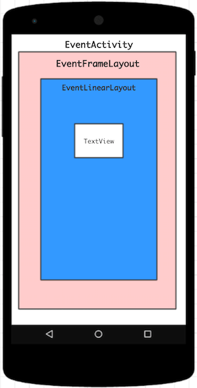

# 第3章 View的事件体系


## View坐标
```
View的宽高计算公式
width = right - left
height = bottom - top

Android3.0开始，View增加了额外几个参数：x、y、translationX、translationY
x和y是View左上角的坐标
translationX和translationY是View左上角相当于父容器的偏移量
translationX和translationY默认为0

换算关系公式
x = left + translationX
y = top + translationY

注意：
View在平移过程中，top和left表示是原始左上角的位置信息，其值并不会发生改变，发送变化的是x、y、translationX和translationY这4个参数

event.getX():表示的是触摸的点距离自身左边界的距离 
event.getY():表示的是触摸的点距离自身上边界的距离
event.getRawX:表示的是触摸点距离屏幕左边界的距离
event.getRawY:表示的是触摸点距离屏幕上边界的距离 
View.getWidth():表示的是当前控件的宽度，即getRight()-getLeft()
View.getHeight()：表示的是当前控件的高度，即getBottom()-getTop() 
View.getTop():子View的顶部到父View顶部的距离
View.getRight():子View的右边界到父View的左边界的距离 
View.getBottom():子View的底部到父View的顶部的距离 
View.getLeft():子View的左边界到父View的左边界的距离 
View.getTranslationX()计算的是该View在X轴的偏移量。初始值为0，向左偏移值为负,向右偏移值为正。 
View.getTranslationY()计算的是该View在Y轴的偏移量。初始值为0，向上偏移为负，向下偏移为证。 
```

## MotionEvent 事件类型
* ACTION_DOWN：手指刚接触屏幕
* ACTION_MOVE：手指在屏幕上移动
* ACTION_UP：手指从屏幕上松开的一瞬间
* ACTION_CANCEL：手指按下锁屏、手指按下不放拖动到屏幕外面
* 
* 点屏幕后立即松开，事件顺序DOWN->UP
* 点屏幕滑动一会在松开，事件顺序DOWN->MOVE->MOVE->...MOVE->->UP
* getX/getY：相对于View左上角的x和y坐标
* getRawX/getRawY：相对于手机屏幕左上角的x和y坐标

## TouchSlop 这个常量是被系统认为滑动和点击事件的临界点
* ViewConfiguration.get(this).getScaledTouchSlop(); 获取系统的滑动常量来，判断此时是否属于滑动事件

## VelocityTracker 速度追踪，用于追踪手指在水平、竖直滑动过程中的速度
* VelocityTracker obtain = VelocityTracker.obtain();
* obtain.addMovement(event);
* obtain.computeCurrentVelocity(1000);
* float xVelocity = obtain.getXVelocity();
* float yVelocity = obtain.getYVelocity();
* obtain.clear();
* obtain.recycle();

```
获取速度之前必须先计算速度，getXVelocity、getYVelocity这2个方法前面必须调用computeCurrentVelocity
这里的速度指一段时间内手指所滑过的像素
比如将时间间隔设为1000ms时，在1s内手指在水平方向从左向右滑过100像素，那么水平速度就是100（速度可以为负数）
当手指从右向左滑动时，水平方向速度即为负值

速度计算公式
速度 = （终点位置 - 起点位置）/ 时间段

computeCurrentVelocity这个方法参数表示的是一个时间单位或者说时间间隔，它的单位是毫秒（ms）
```

## GestureDetector 手势检测

* mGestureDetector = new GestureDetector(this, new MyOnGestureListener());
* boolean consume = mGestureDetector.onTouchEvent(event);


方法名     | 描述                                  | 所属接口
--------  | ------------------------------------ | ------------------- |
onDown  | 手指轻轻触摸屏幕一瞬间，由1个ACTION_DOWN触  | OnGestureListener  |
onShowPress  | 手指轻轻触摸屏幕，尚未松开或拖动，由1个ACTION_DOWN触发，这是单击行为  | OnGestureListener  |
onSingleTapUp  | 手指（轻轻触摸屏幕后）松开，伴随着1个ACTION_UP而触发，这是单击行为  | OnGestureListener  |
onScroll  | 手指按下屏幕并拖动，由1个ACTION_DOWN，多个ACTION_MOVE触发，这是拖动行为  | OnGestureListener  |
onLongPress  | 用户长久按着屏幕不放，即长按  | OnGestureListener  |
onFling  | 用户按下触摸屏、快速滑动后松开，由1个ACTION_DOWN，多个ACTION_MOVE触发和1个ACTION_UP,这是快速滑动行为 | OnGestureListener  |
onDoubleTap  | 双击，由2次连续的单击组成，它不可能和onSingTapConfirmed共存 |  OnDoubleTapListener |
onSingleTapConfirmed  | 严格的单机行为 *注意它和onSingleTapUp区别，如果触发了onSingleTapConfirmed，那么后面不可能再紧跟着另一个单击行为，即这只可能是单击，而不可能是双击中的一次单击 | OnDoubleTapListener |
onDoubleTapEvent  | 表示发生了双击行为，在双击的期间，ACTION_DOWN、ACTION_MOVE、ACTION_UP | OnDoubleTapListener |


## Scroller 弹性滑动对象，用于实现View的弹性滑动

* 我们知道，当使用View的scrollTO/scrollBy方法来进行滑动时，其他过程是瞬间完成的，这个没过渡效果的滑动用户体验不好。
* Scroller派上用场实现有过渡效果的滑动，其过程不是瞬间完成，而是在一定的时间间隔内完成的。
* Scroller本身无法让View弹性滑动，他需要和View的computeScroll方法配合使用才能共同完成这个功能。
* scroollBy源码内部调用了scroollTo,它实现了基于当前位置的相对滑动,scrollTo则实现了绝对滑动

## View事件分发机制

作用域     | 回调方法                               |
--------  | ------------------------------------ |
public boolean dispatchTouchEvent(MotionEvent ev) | 分发TouchEvent,默认返回true |
public boolean onInterceptTouchEvent(MotionEvent ev)  | 拦截TouchEvent,默认返回false |
public boolean onTouchEvent(MotionEvent ev) | 处理TouchEvent,默认返回false |

<br>

作用域     | 回调方法                               |
--------  | ------------------------------------ |
Activity  | dispatchTouchEvent、onTouchEvent |
View      | dispatchTouchEvent、onTouchEvent  |
ViewGroup | dispatchTouchEvent、onInterceptTouchEvent、onTouchEven |




#### 点击TextView控件,日志如下

```java
EventActivity--------> dispatchTouchEvent ACTION_DOWN
EventFrameLayout-----> dispatchTouchEvent ACTION_DOWN
EventFrameLayout-----> onInterceptTouchEvent ACTION_DOWN
EventLinearLayout----> dispatchTouchEvent ACTION_DOWN
EventLinearLayout----> onInterceptTouchEvent ACTION_DOWN
EventView------------> dispatchTouchEvent ACTION_DOWN
EventView------------> onTouchEvent ACTION_DOWN
EventLinearLayout----> onTouchEvent ACTION_DOWN
EventFrameLayout-----> onTouchEvent ACTION_DOWN
EventActivity--------> onTouchEvent ACTION_DOWN
EventActivity--------> dispatchTouchEvent ACTION_UP
EventActivity--------> onTouchEvent ACTION_UP
```

#### 如果EventFrameLayout控件的onInterceptTouchEvent返回true,日志如下

```java

EventActivity-------> dispatchTouchEvent ACTION_DOWN
EventFrameLayout----> dispatchTouchEvent ACTION_DOWN
EventFrameLayout----> onInterceptTouchEvent ACTION_DOWN
EventFrameLayout----> onTouchEvent ACTION_DOWN
...
EventActivity-------> onTouchEvent ACTION_DOWN
EventActivity-------> dispatchTouchEvent ACTION_UP
EventActivity-------> onTouchEvent ACTION_UP

由此可以得出以下结论:

1. 如果返回值是true，即当前的ViewGroup会被处理,注意向下传递会被截断(所有子控件将没有机会参与所有的Touch事件),同时把事件传递给当前控件的onTouchEvent()继续进行传递或处理。

2. 如果返回值是false，即不拦截当前传递来的事件，会继续向下传递，把事件交给子控件的onInterceptTouchEvent()。
```

## View滑动冲突

* 场景 1——————外部滑动方向和内部滑动方向不一致
* 场景 2——————外部滑动方向和内部滑动方向一致
* 场景 3——————上面两种情况的嵌套


```java
    场景1，主要是将ViewPager 和 Fragment配合使用所组成的页面滑动效果，主流应用几乎都会用这个效果。在这种效果中，可
以通过左右滑动来切换页面，而每个页面内部往往又是一个ListView、RecyclerView。本来这种情况下是有滑动冲突的，但是
ViewPager 内部处理这种滑动冲突，因此采用ViewPager我们无须关注这个问题，如果我们采用的不是ViewPager 而是
ScrollView等，那就必须手动处理处理滑动冲突了，否则造成的后果是内外两层只能有一层能够滑动，这是因为两者之前的滑动事
件有冲突。除了这种典型情况外，还存在其他情况，比如外部上下滑动、内部左右滑动等，但是它们属于同一类滑动冲突。

    场景2，这种情况就稍微复杂一些，当内外两层都在同一个方向可以滑动的时候，显示存在逻辑问题。因为当手指开始滑动的时
候，系统无法知道用户到底是想让哪一层滑动，所以当手指滑动的时候就会出行问题，要么只有一层能滑动，要么就是内外两层都滑动
会很卡顿。在实际的开发中，这种场景主要是指内外两层同时能上下滑动或者内外两层同时能左右滑动。


    场景3，场景3是场景1和场景2两种情况的嵌套，因此场景3的滑动冲突看起来就更加复杂了。比如在许多应用中会有这么一个效
果：内层有一个场景1中的滑动效果，然后外层又有一个场景2中的滑动效果。具体说就是，外部有一个SlideMenu效果，然后内部有
一个ViewPager，ViewPager的每一个页面中又是一个ListView。虽然说场景3的滑动冲突看起来更复杂，但是它是几个单一的滑动
冲突的叠加，因此只需要分别处理内层和中层、中层和外层之间的滑动冲突即可，而具体的处理方法其实是和场景1、场景2相同的。


```

